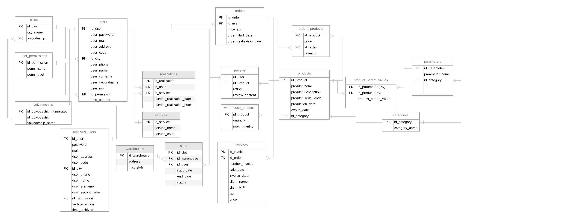

# Podstawowe pojęcia związane z bazami danych (2021)

## Podstawa

### [Właściwości bazy danych](https://mfiles.pl/pl/index.php/Baza_danych)

### Baza danych 

> Baza danych to uporządkowany zbiór danych z określonej dziedziny tematycznej zorganizowany w sposób ułatwiający do nich dostęp

***Baza danych - to zorganizowany zbiór usystematyzowanych informacji, czyli danych, zwykle przechowywany w systemie komputerowym w formie elektronicznej. Bazą danych steruje zwykle system zarządzania bazami danych (DBMS). Dane i system DBMS oraz powiązane z nimi aplikacje razem tworzą system bazodanowy, często nazywany w skrócie bazą danych.***
[lit. 1](https://www.oracle.com/pl/database/what-is-database/)

***Baza danych – zbiór danych zapisanych zgodnie z określonymi regułami. W węższym znaczeniu obejmuje dane cyfrowe gromadzone zgodnie z zasadami przyjętymi dla danego programu komputerowego specjalizowanego do gromadzenia i przetwarzania tych danych. Program taki (często pakiet programów) nazywany jest „systemem zarządzania bazą danych” (ang. database management system, DBMS).***
[lit. 2](https://pl.wikipedia.org/wiki/Baza_danych)

[Ustawa z dnia 27 lipca 2001r.](http://isap.sejm.gov.pl/isap.nsf/download.xsp/WDU20011281402/T/D20011402L.pdf)

Każdy projekt w IT powinien być wykonywany zgodnie z wcześniej ustalonymi wymaganiami. W wymaganiach powinny być zawarte min. definicje, pojęcia na bazie kótrych będzie wykonywan projekt.

#### Dodatkowo
***Jaka jest różnica między bazą danych a arkuszem kalkulacyjnym?***
[Odpowiedź](https://www.oracle.com/pl/database/what-is-database/)

[Ograniczenia dla excela](https://support.microsoft.com/pl-pl/office/specyfikacje-i-ograniczenia-programu-excel-1672b34d-7043-467e-8e27-269d656771c3)

https://eduinf.waw.pl/inf/utils/015_2015/0009.php

**Format TXT**

**Format CSV**
[Stop Using CSVs for Storage — This File Format Is 150 Times Faster](https://towardsdatascience.com/stop-using-csvs-for-storage-this-file-format-is-150-times-faster-158bd322074e)

**JSON**

**XML**

**YAML(YML)**

**Format EDI**

### System zarządzania bazą danych

> SZBD (ang. DBMS) - to program zarządzający danymi w bazie i umożliwiający ich przetwarzanie.

> System bazy danych — to baza danych i system zarządzania bazą danych.

### Relacyjna baza danych

***Relacyjna baza danych to rodzaj bazy danych, który pozwala przechowywać powiązane ze sobą elementy danych i zapewnia do nich dostęp. Relacyjne bazy danych są oparte na modelu relacyjnym — jest to prosty i intuicyjny sposób przedstawiania danych w tabelach. W relacyjnej bazie danych każdy wiersz tabeli jest rekordem z unikatowym identyfikatorem nazywanym kluczem. Kolumny tabeli zawierają atrybuty danych, a każdy rekord zawiera zwykle wartość dla każdego atrybutu, co ułatwia ustalenie relacji między poszczególnymi elementami rekordu.***
[lit. 5](https://www.oracle.com/pl/database/what-is-a-relational-database/)

> Relacyjna baza danych jest to zestaw encji i związków zachodzących miedzy nimi.

### Encja

> Encja jest to każdy przedmiot, zjawisko, stan lub pojęcie, czyli każdy obiekt, który potrafimy odróżnić od innych obiektów (np. osoba, samochód, książka itd)

> Podobne do siebie encje ( te same parametry ) grupujemy w zbiór encji. 

> Projektując bazę danych należy precyzyjnie zdefiniować encje i określić parametry.

### Atrybut

> Encje mają określonr cechy wynikające z ich natury. Cechy te nazywamy **atrybutami**.  

### Dziedzina

> Atrybuty encji mogą przyjmować różne wertości. Projektując bazę danych, możemy określić, jakie wartości może przyjmować dany atrybut. Zbiór wartości atrybutu nazywamy dziedziną (domeną).

## Diagram ERD - wstęp

> Konceptualne projektowanie baz danych to konstruowanie schematu danych niezależnego od wybranego modelu danych, docelowego systemu zarządzania bazą danych, programów użytkowych czy języka programowania.

> Do tworzenia modelu graficznego schematu bazy danych wykorzystujemy diagramy związków encji — diagram ERD (ang. Entity Relationship Diagram)

> Diagram ERD składa się z trzech rodzajów elementów:
> - zbiór encji
> - atrybuty encji
> - związki zachodzące między encjami 

### Przykład diagramu ERD

## [Literatura](literature.md)

## [Narzędzia](utils.md)
